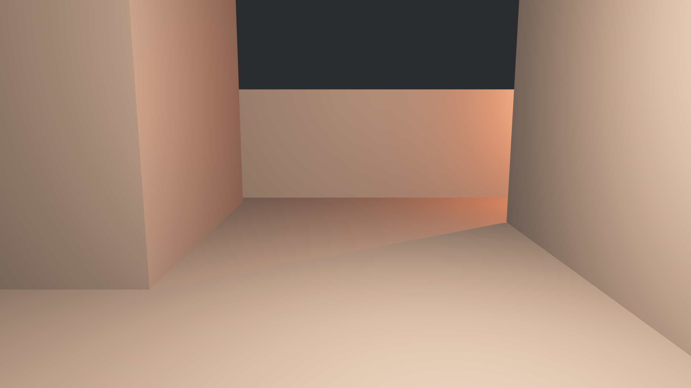

The GLTF extension `KHR_texture_transform` is used to transform a texture before applying it. By reading this extension, Bevy can now support a variety of new workflows.
The one we want to highlight here is the ability to easily repeat textures a set number of times. This is useful for creating textures that are meant to be tiled across a surface. We will show how to do this using Blender, but the same principles apply to any 3D modeling software.

Let's look at an example scene without textures that we've prepared in Blender, exported as a GLTF file and loaded into Bevy.

Now, let's add some textures to the scene.
We will first use the most basic shader node setup available in Blender:

We can use a similar graph for all objects in the scene by using a different texture in each material.
The result is the following scene in Bevy:

Oh no! Everything is stretched! This is because we have set up our UVs in a way that maps the texture exactly once onto the mesh. There are a few ways of how to deal with this, but the most convenient is to add shader nodes that scale the texture so that it repeats:

The data of the `Mapping` node is the one exported to `KHR_texture_transform`. Look at the part in red. These scaling factors determine how often the texture should be repeated in the material. In our case, we eyeballed that the brick texture looks nice when repeated 3 times horizontally and 5.4 times vertically. Tweaking this value for all textures brings us to the final scene:

Looks nice, doesn't it? You can use this approach for other textures as well. In fact, we cheated a bit: the screenshots above already use the scaling factor for their normal, roughness, and metallic maps as well, which works analogously. Simply drag the `Mapping` node's output into the `vector` input of however many textures you want.
