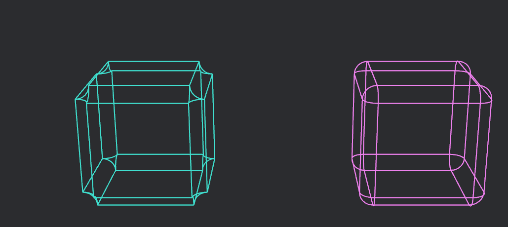
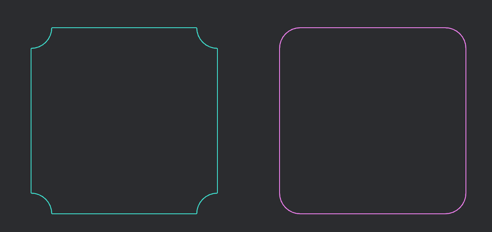

Bevy's gizmos are a powerful tool for debugging and testing and you may want to draw alot of different shapes with them.

As of bevy 0.14 you can also draw rounded rectangles and cuboids!

```rust
gizmos
	.rounded_rect_2d(Vec2::ZERO, 0., Vec2::splat(630.), WHITE)
	.corner_radius(100.);

my_gizmos
	.rounded_cuboid(
		Vec3::ZERO,
		Quat::IDENTITY,
		Vec3::splat(2.),
		WHITE,
	)
	.edge_radius(0.1)
	.arc_resolution(4);
```

If you set the `corner_radius` or `edge_radius` to a positive value, the corners will be rounded outwards. However, if you provide a negative value, the corners will flip and curve inwards.


