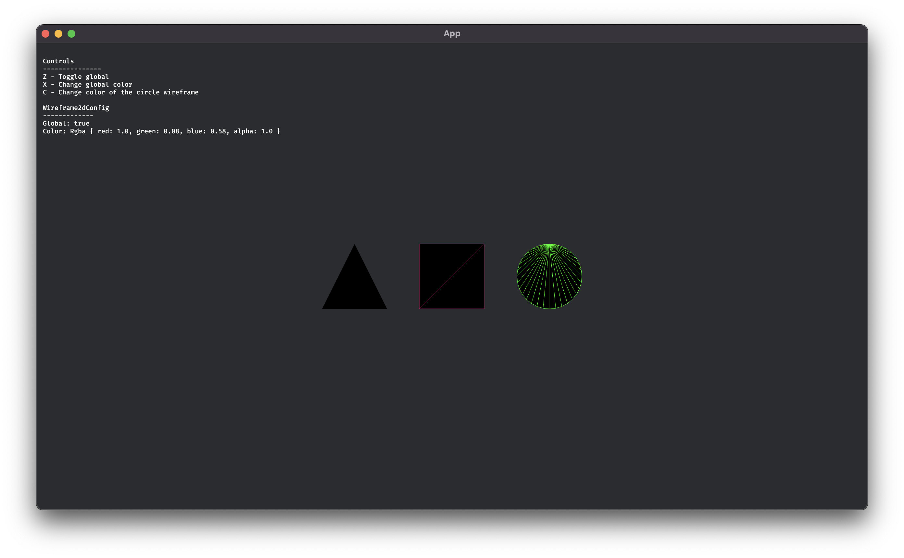

Wireframe materials are used to render the individual edges and faces of a mesh. They are often used as a debugging tool to visualize geometry, but can also be used for various stylized effects. Bevy supports displaying 3D meshes as wireframes, but lacked the ability to do this for 2D meshes until now.

To render your 2D mesh as a wireframe, add `Wireframe2dPlugin` to your app and a `Wireframe2d` component to your sprite. The color of the wireframe can be configured per-object by adding the `Wireframe2dColor` component, or globally by inserting a `Wireframe2dConfig` resource.

For an example of how to use the feature, have a look at the new [wireframe_2d example](https://github.com/bevyengine/bevy/blob/b17292f9d11cf3d3fb4a2fb3e3324fb80afd8c88/examples/2d/wireframe_2d.rs):

