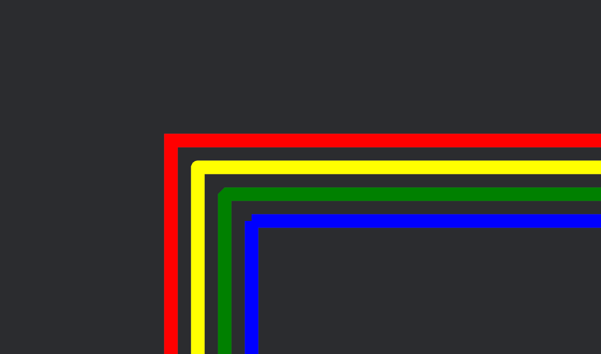

Bevy gizmos are composed of linestrips and a powerful tool for debugging games.

```rust
use bevy::{color::palettes::css::*, prelude::*};

fn draw_gizmos(mut gizmos: Gizmos) {
    gizmos.line_2d(Vec2::ZERO, Vec2::splat(-80.), RED);
}

fn setup(mut commands: Commands) {
    commands.spawn(Camera2dBundle::default());
}

App::new()
	.add_plugins(DefaultPlugins)
	.add_systems(Startup, setup)
	.add_systems(Update, draw_gizmos);
```

But the joints of these gizmos lines, the points at which two lines meet, did not look that good, especially when using gizmos with larger `line_width`s.

As of bevy 0.14, you can change the style of the line-joints for each gizmo config group:

```rust
use bevy::{color::palettes::css::*, prelude::*};

fn draw_gizmos(mut gizmos: Gizmos) {
    gizmos.line_2d(Vec2::ZERO, Vec2::splat(-80.), RED);
}

fn setup(mut commands: Commands, mut config_store: ResMut<GizmoConfigStore>) {
    commands.spawn(Camera2dBundle::default());

	// Get the config for you gizmo config group
    let (config, _) = config_store.config_mut::<DefaultGizmoConfigGroup>();
	// Set the line joints for this config group
	config.line_joints = GizmoLineJoints::Bevel;
}

App::new()
	.add_plugins(DefaultPlugins)
	.add_systems(Startup, setup)
	.add_systems(Update, draw_gizmos);
```

Available line joints are 
- `GizmoLineJoints::Miter`, which extends both lines until they meet at a common miter point and
- `GizmoLineJoints::Round(resolution)`, which will approximate an arc filling the gap between the two lines. The `resolution` determines the amount of triangles used to approximate the geometry of the arc.
- `GizmoLineJoints::Bevel`, which connects the ends of the two joining lines with a straight segment,
- `GizmoLineJoints::None`, which uses no joints - this is the default behaviour and the only one available before bevy 0.14,



You can check out the [2D gizmos example](https://github.com/bevyengine/bevy/blob/main/examples/gizmos/2d_gizmos.rs), which demonstrates the use of line joints.