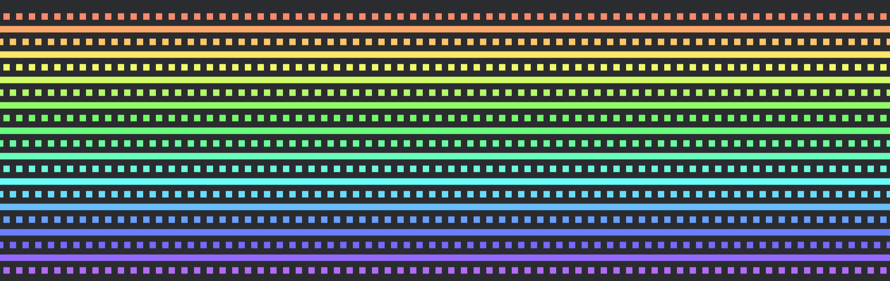

Bevy gizmos are composed of lines and a powerful tool for debugging games.

```rust
use bevy::{color::palettes::css::*, prelude::*};

fn draw_gizmos(mut gizmos: Gizmos) {
    gizmos.line_2d(Vec2::ZERO, Vec2::splat(-80.), RED);
}

fn setup(mut commands: Commands) {
    commands.spawn(Camera2dBundle::default());
}

App::new()
	.add_plugins(DefaultPlugins)
	.add_systems(Startup, setup)
	.add_systems(Update, draw_gizmos);
```

Previously however, the only way to customize gizmos was to change their colour, which may be limiting for some use cases.

As of bevy 0.14, you can change the style of the lines for each gizmo config group:

```rust
use bevy::{color::palettes::css::*, prelude::*};

fn draw_gizmos(mut gizmos: Gizmos) {
    gizmos.line_2d(Vec2::ZERO, Vec2::splat(-80.), RED);
}

fn setup(mut commands: Commands, mut config_store: ResMut<GizmoConfigStore>) {
    commands.spawn(Camera2dBundle::default());

	// Get the config for you gizmo config group
    let (config, _) = config_store.config_mut::<DefaultGizmoConfigGroup>();
	// Set the line joints for this config group
	config.line_style = GizmoLineStyle::Dotted;
}

App::new()
	.add_plugins(DefaultPlugins)
	.add_systems(Startup, setup)
	.add_systems(Update, draw_gizmos);
```

The new line styles can be used in both 2D and 3D and respect the `line_perspective` option of their config groups.

Available line styles are 
- `GizmoLineStyle::Dotted`, which draws a dotted line with each dot being a square
- `GizmoLineStyle::Solid`, which draws a solid line - this is the default behaviour and the only one available before bevy 0.14,



You can check out the [2D gizmos example](https://github.com/bevyengine/bevy/blob/main/examples/gizmos/2d_gizmos.rs), which demonstrates the use of line joints.