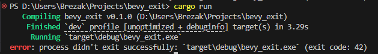

When running an app, there might be many reasons to trigger an exit. Maybe the user has pressed the quit button, or the render thread has encountered an error and died. You might want to distinguish between these two situations and return an appropriate [exit code](https://doc.rust-lang.org/std/process/struct.ExitCode.html#impl-From%3Cu8%3E-for-ExitCode) from your application.

In **Bevy 0.14**, you can. The `AppExit` event is now an enum with two variants: `Success` and `Error`. The error variant also holds a non-zero code, which you're allowed to use however you wish. Since `AppExit` events now contain useful information, app runners and `App::run` now return the event that resulted in the application exiting.

For plugin developers, `App` has gained a new method, `App::should_exit`, which will check if any `AppExit` events were sent in the last two updates. To make sure `AppExit::Success` events won't drown out useful error information, this method will return any `AppExit::Error` events, even if they were sent after an `AppExit::Success`.

Finally, `AppExit` also implements the [`Termination`](https://doc.rust-lang.org/stable/std/process/trait.Termination.html) trait, so it can be returned from main.

```rust
use bevy::prelude::*;

fn exit_with_a_error_code(mut events: EventWriter<AppExit>) {
    events.send(AppExit::from_code(42));
}

fn main() -> AppExit {
    App::new()
        .add_plugins(MinimalPlugins)
        .add_systems(Update, exit_with_a_error_code)
        .run() // There's no semicolon here, `run()` returns `AppExit`.
}
```


